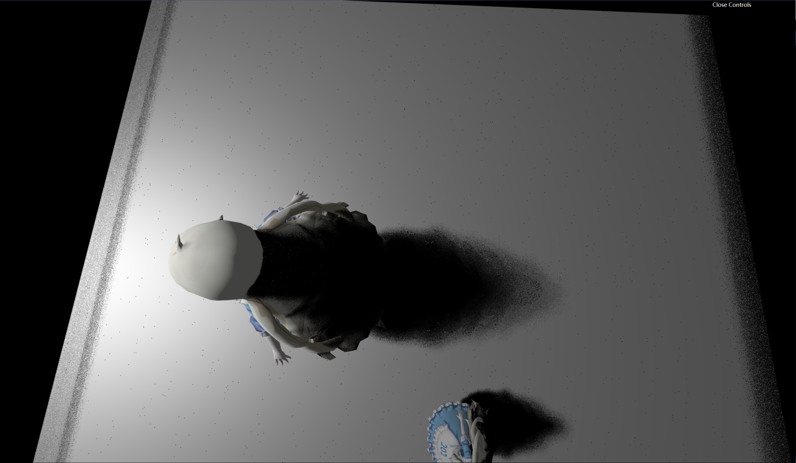

# GAMES202 

update: 2023-06-20 finish Assignment0

### Assignment1

1. Shadow Map

实现硬阴影：

    

存在大量锯齿及自遮挡：

    
    

增加一个bias可以改善自遮挡现象，但无法解决锯齿，且会出现影子与物体分离的情况：

    
    

2. PCF
本身是做一个滤波来解决锯齿的现象：

    
    

也可以用来做软阴影，当filter size变大时：

    

阴影也呈现更软，但是图片的噪声会增加

3. PCSS

可以看到近处和远处的阴影是从硬到软的，但是存在大量噪声尤其是边缘

    
    
(shadowMap query area size: 100/2048（左）      20/2048（右）)

增大采样数可以减少噪声，但是平面上边缘仍有大量噪声，且影子有明显的分层：

    
    
(sample num: 20（左）      50（右）)

平台边缘的噪声是因为shadowMap中默认背景值为0， 调整为最远距离1即可
明显分层在将采样方法从uniform改为泊松采样后有所改善：
增大采样数可以减少噪声，但是平面上边缘仍有大量噪声，且影子有明显的分层：

    
    
(uniform sample（左）      poission sample（右）)

